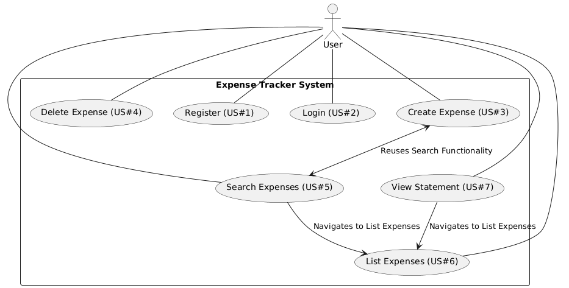
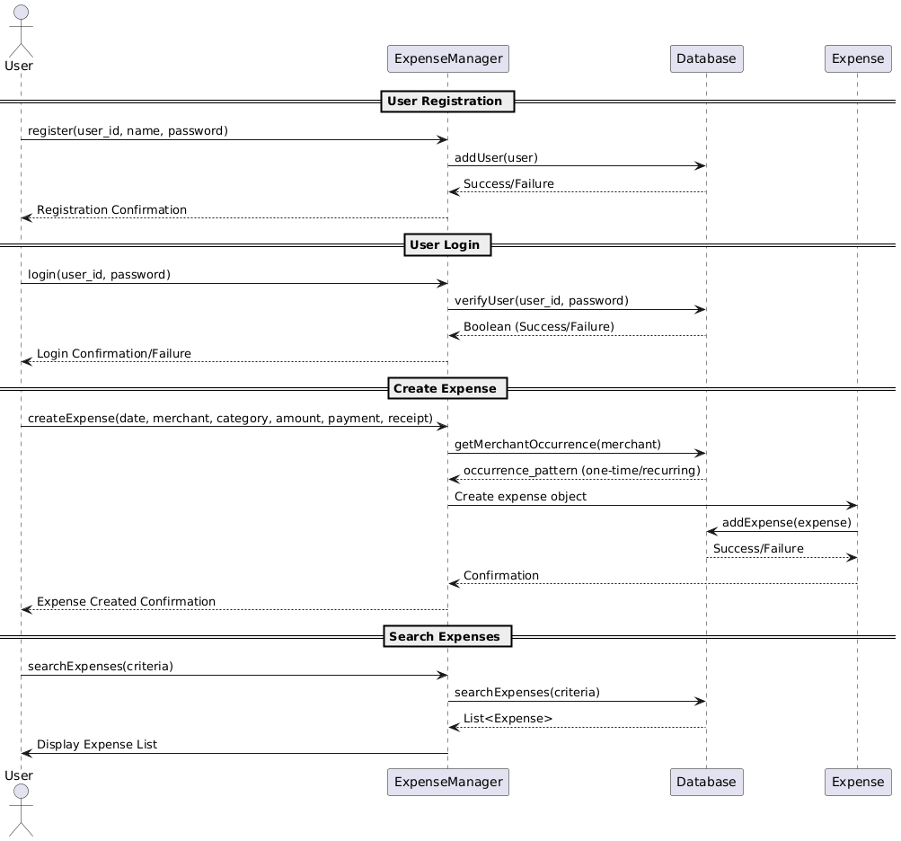
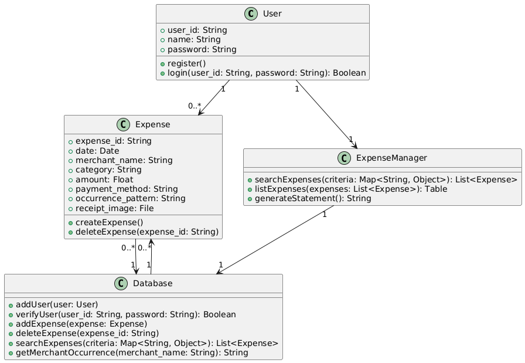
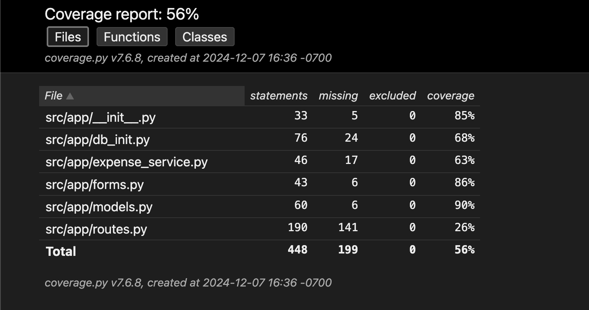

# Budget Web App Overview
## Our Mission
This budgeting web application allows individuals to take control of their finances by providing a web platform where users can track expenses, manage budgets, and obtain insights on spending habits in one place. Many people have difficulty tracking and managing their expenses by not being able to get specific information in their budgets. Our web platform offers families, students, professionals and others seeking better financial organization a place to record, catergorize, and retrieve financial information of their expenses.

## Use Case Diagram

## Sequence Diagram

## Class Diagram

## User Stories

### US#1: User Registration (sign up)

As a user, I want to register on the platform to begin tracking my expenses. When I provide all the required information (user ID, name, and password) and click 'Sign Up' the system should verify my credentials. If they are valid, my account should be created and I should be redirected to the welcome page.

```
User story points: 5
```

### US#2: User Authentication (log in)
As a registered user, I want to log in to the platform. When I enter my user ID and password and click 'Log In', the system should verify my credentials. If they match the records in the database, I should be granted access to navigate the app and be redirected to the home page.

```
User story points: 5
```

### US#3: Create Expense
As a registered user, I want to create new expenses. Each expense should have a unique ID and include the following information: date of transaction, merchant name, category, amount, and payment method. Optionally, I should be able to add an image of my receipt. Before I submit, the system should check the merchant name in the database to check if it is a one time purchase or reoccuring purchase and save that result with the new expense information to the database.

```
User story points: 15
```

### US#4: Delete Expense
As a registered user, I want to delete my expenses. When I provide the expense's ID and and click 'Confirm' the expense should be removed from the database.

```
User story points: 10
```

### US#5: Search Expenses
As a registered user, I want to search through my expenses by date, category, payment method, and if its a reoccuring or one-time charge. When I enter my search parameters and click 'Search' I should be redirected the search results page (US#6) that displays the expenses.

```
User story points: 25
```

### US#6: List Expense Results
As a registered user, I want to view a summarized table of my expenses based on specific search criteria. The table should display a limited number of expenses to fit the screen and include the following for each expense: the expense ID, date of transaction, merchant name, category, amount, payment method, and image if available. I should be able to navigate forward and backward through the filtered list of expenses.

```
User story points: 15
```

### US#7: Expenses Statement
As a registered user, I want to view a summarized statement of all of my expenses to date. The statement should display the period the statement covers, my user information, a limited number of expenses to fit the screen and include the following for each expense: date of transaction, merchant name, and amount. Additionally, I should be able to view a summary of my expense amounts that includes total spent and total spent by payment method. I should be able to navigate forward and backward through the statement.

```
User story points: 25
```


## Development Process 
|Sprint#|Goals|Start|End|Done|Observations|
|---|---|---|---|---|---|
|1|Complete file structure, UML diagrams and user stories 1, 2 and 4.|11/14/24|11/25/24|Completed UML diagrams and user stories 1, 2 and 4.|Everything was completed as expected.|
|2|Complete user stories 3, 5 and 7.|11/26/24|12/02/24|Completed user stories 3, 5 and 6.|User story 7 wasn't completed but we did finish user story 6 which wasn't originally scheduled.|
|3|Complete user story 7.|12/03/24|12/07/24|Completed user story 7.|We successfully completed all the user stories.|

## Testing 
|Component|Type|
|---|---|
|Expense Creation|Blackbox|
|ExpenseService Class|Whitebox|
